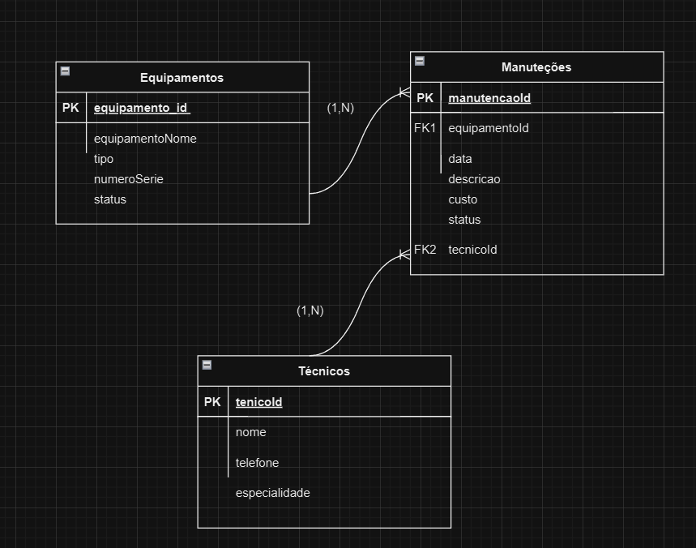

## 🛠️ Teste Técnico ZDZCode
Olá!
Primeiramente, agradeço pela oportunidade de participar deste processo seletivo. Abaixo, apresento uma descrição detalhada do desenvolvimento do projeto proposto.

Para rodar o front end desse projeto você precisara fazer o procedimento padrão: 
cd ./zdz-code-test
yarn build
yarn dev

💡 Ideia do Projeto: Sistema de Histórico de Manutenção de Equipamentos
A solução foi planejada para gerenciar o histórico de manutenções de equipamentos, contemplando:

- Cadastro de equipamentos com informações como nome, tipo e número de série.
- Registro de manutenções, incluindo data, custo e técnico responsável.
- Consulta do histórico de manutenções para cada equipamento.

Esta escolha se baseou em uma situação do meu dia dia que enfrentamos na faculdade na parte de manutenções dos servidores.

📊 1ª Etapa: Modelagem de Dados
Ferramenta Utilizada:
Optei pelo uso do draw.io para modelar o banco de dados. É uma ferramenta que já conhecia e que utilizo frequentemente por sua facilidade e recursos visuais.

No modelo apresentado, os tipos de relações entre as tabelas são as seguintes:

*Equipamentos → Manutenções*
Tipo: 1 para N (Um para Muitos)
- Justificativa: Cada equipamento pode ter várias manutenções, mas cada manutenção está vinculada a apenas um equipamento.

*Técnicos → Manutenções*
Tipo: 1 para N (Um para Muitos)
- Justificativa: Um técnico pode ser responsável por várias manutenções, mas cada manutenção está vinculada a apenas um técnico.

*Legenda:*

Linhas representam os relacionamentos entre as tabelas.
FK: Chave estrangeira.
PK: Chave primária.

🎨 2ª Etapa: Protótipo de Interface
As interfaces foram projetadas para serem simples e intuitivas, utilizando as tecnologias solicitadas: Vue.js 3, Nuxt.js e Vuetify.
E para o desneho das interfaces utilizei como referencia o logo da ZDZ. E fui montando as telas seguindo isso, desenhei alguns esbosos e montei.
